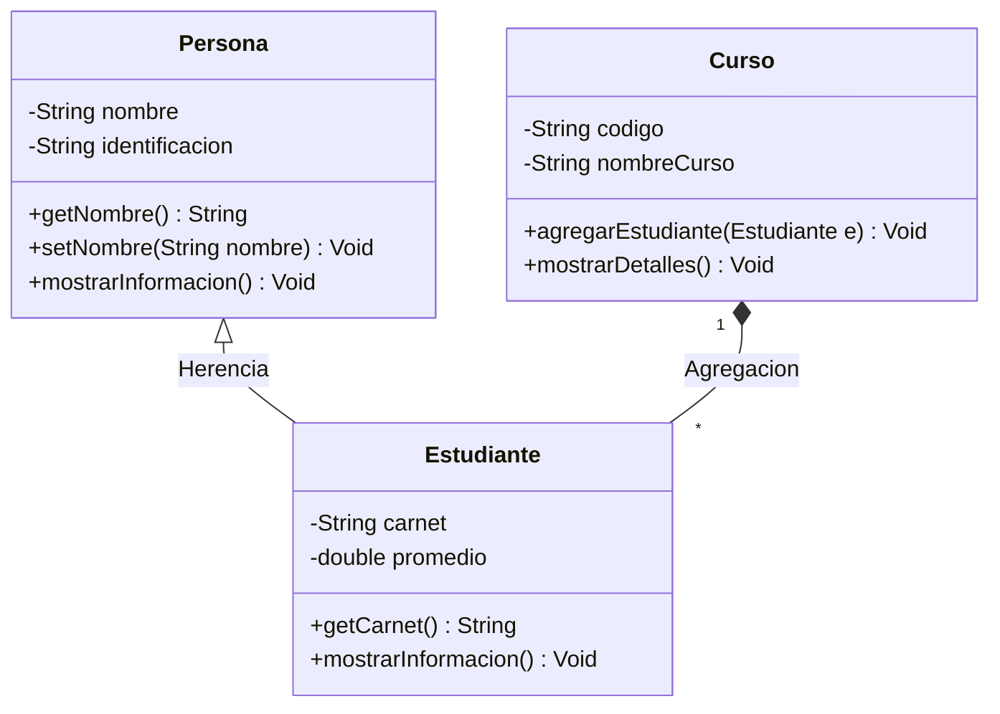

```mermaid
classDiagram
    class Persona {
        -String nombre
        -String identificacion
        +getNombre() String
        +setNombre(String nombre) Void
        +mostrarInformacion() Void
    }

    class Estudiante {
        -String carnet
        -double promedio
        +getCarnet() String
        +mostrarInformacion() Void
    }

    class Curso {
        -String codigo
        -String nombreCurso
        +agregarEstudiante(Estudiante e) Void
        +mostrarDetalles() Void
    }

    Persona <|-- Estudiante : Herencia
    Curso "1" *-- "*" Estudiante : Agregacion
```