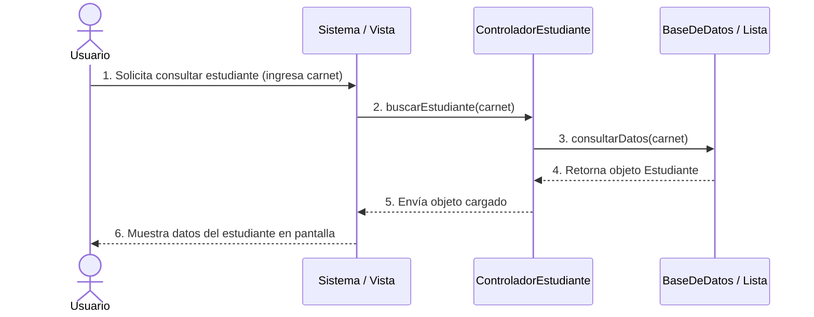

```mermaid
sequenceDiagram
    actor Usuario
    participant Sistema as Sistema / Vista
    participant Controller as ControladorEstudiante
    participant BD as BaseDeDatos / Lista

    Usuario->>Sistema: 1. Solicita consultar estudiante (ingresa carnet)
    Sistema->>Controller: 2. buscarEstudiante(carnet)
    Controller->>BD: 3. consultarDatos(carnet)
    BD-->>Controller: 4. Retorna objeto Estudiante
    Controller-->>Sistema: 5. Envía objeto cargado
    Sistema-->>Usuario: 6. Muestra datos del estudiante en pantalla
```